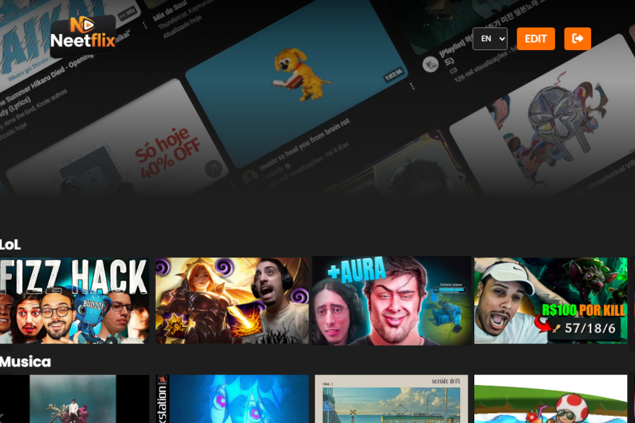

<h1 align="center" style="font-weight: bold;">Neetflix 🍿</h1>

<p align="center">
 <a href="#tech">Technologies</a> • 
 <a href="#started">Getting Started</a> 
</p>

<p align="center">
    <b>It's a clone of the famous website Netflix.</b>
</p>

<p align="center">
     <a href="https://neetflix-app-pi.vercel.app/">📱 Visit "Neetflix"</a>
</p>

<h2 id="layout">🎨 Layout</h2>

<p align="center">
    
    
</p>


<h2 id="technologies">💻 Technologies</h2>


<h2 id="features">✨ Features</h2>

- 🎬 **Video Lists** for each gender (Music, LoL, Reviews etc.). 
- 👤 **User authentication** (Login and SignUp) using Firebase.
- 📺 **Video Player** Using the native youtube player with iframes.
- 🧩 **Admin area to edit**, delete and manage videos.
- 🌐 **Responsive layout** for all devices.

<h2 id="started">🚀 Getting Started</h2>

Follow the steps below to run the project locally.

### Prerequisites

Make sure you have installed:

- [Node.js](https://nodejs.org/)
- [Git](https://git-scm.com/)

### Cloning

```bash
git clone https://github.com/michaelcostaribeiro/neetflix.git
```

<h3>Starting</h3>

How to start the project

```bash
cd neetflix
npm run dev
```

<h2>📄 License</h2>

This project is under the MIT License.
